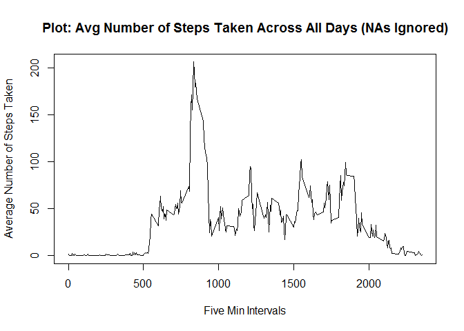

# Reproducible Research: Peer Assessment 1


## Loading and preprocessing the data

Load data file “activity.csv” using read.csv, ensuring the number of steps and interval values are captured as integers while date strings are initially captured as characters


```r
actData <-
      read.csv(
            "./activity/activity.csv",
            head=TRUE,
            colClasses=c("integer", "character", "integer"),
            na.strings="NA"
      )

lapply(actData, class)
```

```
## $steps
## [1] "integer"
## 
## $date
## [1] "character"
## 
## $interval
## [1] "integer"
```

```r
head(actData)
```

```
##   steps       date interval
## 1    NA 2012-10-01        0
## 2    NA 2012-10-01        5
## 3    NA 2012-10-01       10
## 4    NA 2012-10-01       15
## 5    NA 2012-10-01       20
## 6    NA 2012-10-01       25
```

Process data by ...
- Properly representing dates.
- Create 2nd database without rows with NAs (keep 1st for later).


```r
actData$date <- as.Date(actData$date, format="%Y-%m-%d")

actData_NoNA <- subset(actData, !is.na(actData$steps))

class(actData_NoNA$date)
```

```
## [1] "Date"
```

```r
head(actData_NoNA)
```

```
##     steps       date interval
## 289     0 2012-10-02        0
## 290     0 2012-10-02        5
## 291     0 2012-10-02       10
## 292     0 2012-10-02       15
## 293     0 2012-10-02       20
## 294     0 2012-10-02       25
```
## What is mean total number of steps taken per day?

Create a histogram (showing distribution) of daily total number of steps taken per day.


```r
dayStepSum_NoNA <-
      tapply(
            actData_NoNA$steps,
            actData_NoNA$date,
            sum,
            simplify=T
      )

hist(
            x=dayStepSum_NoNA,
            col="blue",
            breaks=21,
            xlab="Daily Total Steps",
            ylab="# Days Observed",
            main="Hist: Total Number Steps Taken Each Day (NA data ignored)"
      )
```

 

Next, calculate and report the mean and median total number of steps taken per day.


```r
dayStepSumMean_NoNA <- as.integer(mean(dayStepSum_NoNA))
dayStepSumMedian_NoNA <- as.integer(median(dayStepSum_NoNA))
```

<u>MEAN and MEDIAN of Total Number of Steps Taken Each Day (ignoring NAs):  mean = 10766 and median = 10765.</u>

## What is the average daily activity pattern?

To show the average daily activity pattern, we make a time series plot of 5-minute intervals (x-axis) and the average number of steps taken, averaged across all days (y-axis).


```r
actIntAvg_NoNA <- tapply(actData_NoNA$steps, actData_NoNA$interval, mean, na.rm=TRUE, simplify=T)

df_AIA_NoNA <- data.frame(interval=as.integer(names(actIntAvg_NoNA)), avg=actIntAvg_NoNA)

with(df_AIA_NoNA,
     plot(interval,
          avg,
          type="l",
          xlab="Five Min Intervals",
          ylab="Average Number of Steps Taken",
          main="Plot: Avg Number of Steps Taken Across All Days (NAs Ignored)"))
```

 

Calculate and report which 5-minute interval on average across all the days in the dataset, contains the maximum number of steps.


```r
maxSteps_NoNA <- max(df_AIA_NoNA$avg)
ans <- df_AIA_NoNA[df_AIA_NoNA$avg == maxSteps_NoNA, ]
av_ans <- as.integer(ans$avg)
```

<u>The 5-min interval 835 with value 206 contained the max number of steps taken (ignoring NAs).</u>

## Imputing missing values

Calculate and report total number of missing values in the dataset (total number of rows with NAs).


```r
actData_NumNA <- sum(is.na(actData$steps))
```

Total number of missing values in dataset is 2304.

<u>STRATEGY FOR IMPUTING MISSING DATA: We will use a simple strategy for filling in dataset missing values in the dataset: If 5-minute interval has missing value then we substitute the mean for that 5-minute interval across all days.</u>

Create the new dataframe with missing values filled in using the simple strategy above.


```r
actData_Imputed <- actData
indx <- is.na(actData_Imputed$steps)
intAvg <- tapply(actData_NoNA$steps, actData_NoNA$interval, mean, na.rm=TRUE, simplify=T)
actData_Imputed$steps[indx] <- intAvg[as.character(actData_Imputed$interval[indx])]
```

Create histogram of total number steps taken per day using the dataset with NA values imputed.


```r
dayStepSum_Imputed <-
      tapply(
            actData_Imputed$steps,
            actData_Imputed$date,
            sum,
            simplify=T
      )

hist(
            x=dayStepSum_Imputed,
            col="blue",
            breaks=21,
            xlab="Daily Total Steps",
            ylab="# Days Observed",
            main="Hist: Total Number of Steps Taken Each Day (NA values imputed)"
      )
```

 

Next, calculate and report the mean and median total number of steps taken per day.


```r
dayStepSumMean_Imputed <- as.integer(mean(dayStepSum_Imputed))
dayStepSumMedian_Imputed <- as.integer(median(dayStepSum_Imputed))
```

<u>MEAN and MEDIAN of Total Number of Steps Taken Each Day (with imputed NAs):  mean = 10766 and median = 10766.</u>

Recalling the mean of the UN-Imputed Dataset = 10766 and the median of the UN-Imputed Dataset = 10765 ... the mean does not change and the median has a small change. Also, the new imputed median becomes identical to the mean.

Based on the distribution histograms, Imputing mean values to account for missing data on the estimates of the total daily number of steps yields higher frquency counts in the center of the histogram (close to its mean).


## Are there differences in activity patterns between weekdays and weekends?

Create a new factor with two levele 'weekday' and 'weekend' where 'weekday' implies Monday thru Friday and 'weekend' implies Saturday thru Sunday.


```r
actData_Imputed <- transform(actData_Imputed, timeframe=factor(ifelse((weekdays(date) %in% c("Saturday", "Sunday")), "weekend", "weekday")))

head(actData_Imputed)
```

```
##       steps       date interval timeframe
## 1 1.7169811 2012-10-01        0   weekday
## 2 0.3396226 2012-10-01        5   weekday
## 3 0.1320755 2012-10-01       10   weekday
## 4 0.1509434 2012-10-01       15   weekday
## 5 0.0754717 2012-10-01       20   weekday
## 6 2.0943396 2012-10-01       25   weekday
```

Next we make a panel plot containing a time series plot (i.e. type = “l”) of the 5-minute interval (x-axis) and the average number of steps taken, averaged across all weekday days or weekend days (y-axis).


```r
intByWeek <- aggregate(steps ~ timeframe+interval, data=actData_Imputed, FUN=mean)

library(lattice)
xyplot(steps ~ interval | timeframe,
       layout = c(1, 2),
       xlab="5 Minute Interval",
       ylab="Avg Number of Steps Taken",
       main="Avg Num Steps Taken per 5-Min Int Across Weekdays & Weekends",
       type="l",
       lty=1,
       horizontal=FALSE,
       data=intByWeek)
```

 

It seems that the weekday activities start sooner than those on the weekends; however, weekend activities have higher exertions a few hours before noon until evening (around 9 pm).  Through the night until early morning (9 pm to 5 am), both activity levels seem to be similar.

